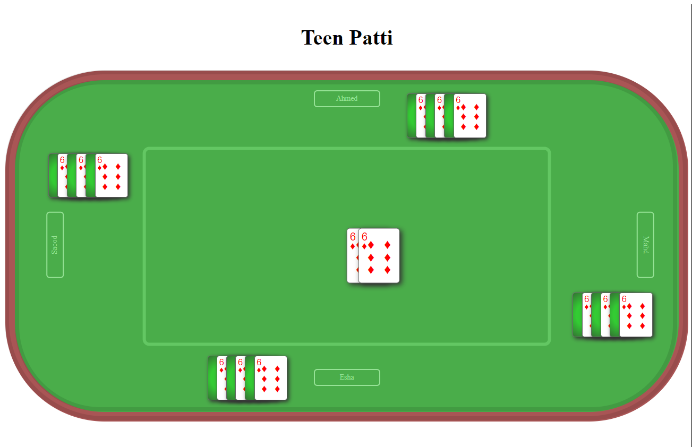

# Teen Patti Game

## Overview
Developed a Teen Patti game using Express.js, React, and Node.js with TypeScript.

## Technical Requirements
- MERN Stack: Express.js, React, Node.js.
- Socket.IO for real-time communication.
- TypeScript for front-end and back-end.

# Teen Patti Game Rules

## Players
- 4 players required, each playing independently.

## Setup
- Players receive 3 face-down cards, 3 face-up cards, and 3 hand cards.
- Face-up cards are visible to all players.
- The rest of the deck is set aside.

## Gameplay
- Begins with the top card from the deck placed in the center.
- Players play cards in a sequence: player 1, 2, 3, then 4.
- A player must throw a card of the same or higher value than the topmost card.
- After playing a card, the player picks one from the deck, always keeping at least 3 cards in hand.
- When the deck is finished, players use their face-up cards, and then face-down cards.

## Power Cards
- **2 (Refreshing Card):** Allows throwing another card, resetting the game from that card.
- **7 (Low Card):** Next player must throw a 7 or lower.
- **8 (Invisible Card):** Game continues from the card below 8.
- **10 (Burns the Pile):** Clears the pile, next player starts with any card.

- If a player can't play a valid card, they pick up the pile and skip their turn.
- The game ends when a player uses all their cards.

## Running the Game
1. Start server on port 3001.
2. Launch React front-end on port 3000.
3. Supports multiple clients.

## Contribution
Adhere to academic integrity and originality guidelines.
